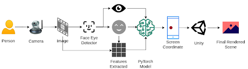

# GazePlay

An end to end real-time gaze detection pipeline with foveated rendering

Today’s games and complex 3D scenes have pushed the current hardware to its limits. If you want to enjoy a 60FPS 4K gameplay of any modern AAA game, you need a top of the line GPU and CPU which are out of reach of many users for many reasons, hence depriving them of majority of the users to experience the latest technology. 
But if we look closely, we don’t need high res for all parts of the screen, we only need for the part where the user is looking at, isn’t it?
So why don't we just render the scene of current focus at max resolution but all the other parts at low resolution, hence saving a tons of resources and compute.

We solve this problem in 2 parts:
- Detecting GazePoint using Deep Learning
- Rendering the scene around the gazed point at highest resolution ( Foveated Rendering)

## Proposed Solution

This repository contains code for
- Face Eye detecter
- Pytorch Gaze point prediction model (with pretrained model)
- Callibiration
- Pipeline to detect gaze point

Foveated rendering code in unity is available [here](https://github.com/exclowd/foveated-rendering).

## Project presentation
A detailed presentation of the project including experiments, approaches tried and final results is present [here](./GazePlay.pdf)

## Demo
Video demo of the system available [here](https://www.youtube.com/watch?v=7MKH-BwySrI)
